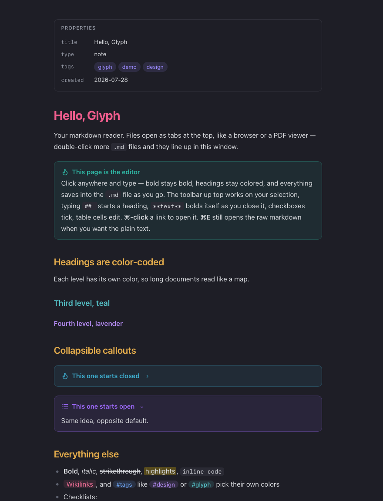
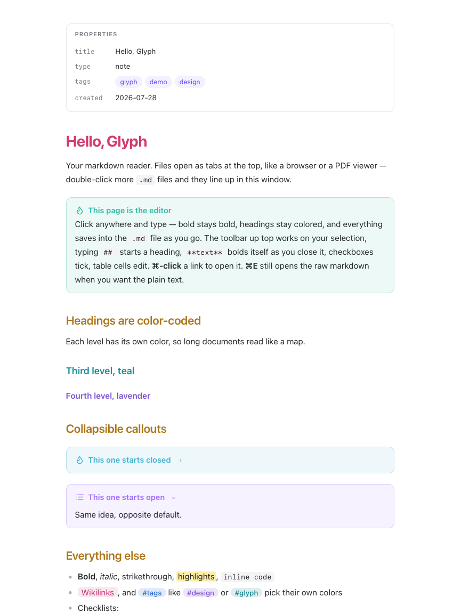

# Glyph

A small app for reading and editing markdown — Obsidian's live preview, without the vault. Native on **macOS, Windows and Linux**, and it can serve a folder of notes to your **phone**.

LLM workflows produce piles of `.md` files. Obsidian wants them moved into a vault before it treats them well; TextEdit shows you raw asterisks. Glyph is the missing middle: double-click any markdown file anywhere on disk and it opens instantly as a formatted, editable page.

One interface everywhere. `Resources/viewer.html` *is* the app — the renderer, the live editor and the serializer — and each platform is a thin native shell around it. That is also why it runs in a browser as a single self-contained file, and on a phone with no app to install.

<p>
  
  
</p>

## What it does

- **The formatted page is the editor.** Click anywhere and type — formatting stays rendered while the file updates underneath (a DOM→markdown serializer writes your edits back continuously). No modes to think about.
- **Markdown-as-you-type.** `## ` starts a heading, `- ` a list, `- [ ] ` a checkbox, `1. ` a numbered list, `> ` a quote; `**bold**`, `*italic*`, `==highlight==`, `~~strike~~`, and `` `code` `` convert as you close them.
- **Obsidian-flavored rendering:** callouts with icons and `-`/`+` fold markers, `[[wikilinks]]`, `#tags` (each picks its own color), YAML frontmatter as a Properties panel, `![[image]]` embeds, checklists, tables you can type into.
- **Color-coded hierarchy** — H1 rose, H2 gold, H3 teal, H4 lavender — so long documents read like a map. Dark and light themes follow the system, or force either from View → Appearance.
- **Tabs.** Every file opens as a tab in one window, like a browser. Drag a tab out for a second window.
- **A formatting toolbar** above the page: undo/redo, headings, bold/italic/underline/strike/highlight, code, link, picture (copied next to the note so it travels with it), lists, checklist, quote, callout, table, code block, clear formatting.
- **⌘-click opens links** in your browser; plain click places the cursor. **⌘E** flips to the raw markdown text and back — and the raw view is a proper source editor: syntax coloring that uses the same palette as the formatted view (an H2 is gold in both), dimmed markers so you read the writing rather than the punctuation, and a line-number gutter.
- **Copy as markdown.** ⌘A selects the note, ⇧⌘C copies it — the selection if there is one, the whole note if there is not — as *markdown*, not as flattened text. A toolbar button copies the whole note in one click, which is the only way to do it on a phone.
- Word count, find (⌘F in raw mode), autosave with macOS version history, and pasted markdown formats itself.

No Electron. The whole app is a few small source files; it compiles in seconds and launches instantly.

## Install

Build from source — needs only Apple's Command Line Tools (no Xcode):

```bash
git clone https://github.com/cvdvs/glyph-md.git
cd glyph-md
./build.sh
cp -R build/Glyph.app /Applications/
```

Open any `.md` with right-click → Open With → Glyph. To make Glyph the default app for markdown files:

```bash
clang -fobjc-arc Scripts/set-default-md.m -o /tmp/glyph-default -framework Cocoa -framework UniformTypeIdentifiers && /tmp/glyph-default
```

Glyph also registers for `.txt`, so it shows up under right-click → Open With
straight away. To make it the **default** for text files, macOS 26 requires you
to do it yourself (an app is no longer allowed to claim a built-in type): right-click
any `.txt` → **Get Info** → under "Open with" choose **Glyph** → **Change All…**.
`.csv`, `.json` and source files carry their own types and are unaffected.

Requires macOS 13+. Uninstall by deleting `/Applications/Glyph.app`.

### Windows and Linux

There is a native build for both. It is the same editor — the interface is one
shared file that all three builds render — wrapped in a small native shell that
owns the window, the files and the dialogs.

**Windows** needs the [Build Tools for Visual Studio](https://visualstudio.microsoft.com/downloads/)
with the C++ workload, and Python 3:

```powershell
git clone https://github.com/cvdvs/glyph-md.git
cd glyph-md
./shell/build-portable.ps1
```

That produces `shell\build\glyph.exe`. The Microsoft Edge WebView2 runtime is
already on Windows 11 and most Windows 10 machines; if it is missing, Glyph says
so and links to it.

**Linux** needs WebKitGTK:

```bash
sudo apt install build-essential pkg-config libgtk-3-dev libwebkit2gtk-4.1-dev
git clone https://github.com/cvdvs/glyph-md.git
cd glyph-md
./shell/build-portable.sh
```

That produces `shell/build/glyph`. A `.deb` is built in CI and attached to each
run, and registers Glyph for markdown files.

Either build can check itself:

```bash
./shell/build/glyph --selftest
```

It renders the real fixtures, runs the same three assertion suites the Mac app
runs, and compares the markdown it writes back byte-for-byte against the
expected output. See [docs/cross-platform.md](docs/cross-platform.md) for how
the shell works and what is known not to work yet.

### Any other computer

There is also a **single HTML file** that runs the same editor in any browser:
tabs, the formatting toolbar, open and save, raw markdown view, light and dark.
Nothing to install, no server, no network — the whole app is one self-contained
file.

Grab `glyph.html` from the [latest release](https://github.com/cvdvs/glyph-md/releases)
and open it, or build it yourself:

```bash
python3 Scripts/make-preview.py sample.md glyph.html --chrome
```

In Chrome and Edge it saves straight back to the file you opened. Safari and
Firefox lack that browser API, so saving downloads the file instead. Pictures are
embedded in the document rather than copied next to it, since a web page cannot
write files beside your note.

### On your phone (read and edit a folder from anywhere in the house)

Run a small server on the machine that holds your notes — a Mac mini, a laptop
that stays on — pointed at a folder of `.md` files:

```bash
node server/glyph-server.mjs ~/Documents/drafts
```

It prints a link carrying a token. Open it **once** on your phone (same wifi) and
it pairs. You get the full Glyph editor plus a **folder tree** of the notes it
serves — collapsible, filterable, remembering what you left open. Open a draft, read it, edit it — every change saves
straight back to the file on the computer. There is only **one copy** of each
file, so it is genuinely live and there is nothing to sync and no conflict to
untangle; close the phone and the edit is already on disk.

**Add it to your home screen** (iOS: Share → Add to Home Screen) and it opens
full-screen with its own icon and no browser chrome: touch targets sized to 44pt,
the toolbar padded for the notch, and a text-size control for reading in bed.

Node standard library only — nothing to `npm install`. **Security:** every
request needs the token, a request can never read or write outside the served
folder, an unsaved edit is kept on the phone and retried if the connection drops,
and a file changed on the computer meanwhile is never silently overwritten. Keep
it on your home network and do **not** port-forward it; for access from anywhere,
put both devices on [Tailscale](https://tailscale.com) (free, encrypted, private
— only your own devices) and use the Tailscale address, which the server prints
for you.

It can also start at login and restart itself, so there is no window to keep
open. See [docs/mobile.md](docs/mobile.md) for that, for Tailscale, and for why
the always-on route needs one macOS permission.

## Plain text files

Glyph opens `.txt`, `.text` and `.log` as **plain text**: no markdown
formatting, no syntax colouring, and saved back exactly as typed — byte for
byte. The formatted view tidies markdown as you edit (bullet markers, spacing),
which is right for a `.md` and wrong for a file that has to come back unchanged,
so it stays off for plain text. Rename a file to `.md` if you want it formatted.

## Shortcuts

| Keys | Does |
| --- | --- |
| ⌘E | Toggle formatted / raw markdown |
| ⌘B / ⌘I / ⌘U / ⌘K | Bold / italic / underline / link |
| ⌘1 ⌘2 ⌘3 | Heading level |
| ⇧⌘X / ⇧⌘H | Strikethrough / highlight |
| ⇧⌘8 / ⇧⌘L | Bullet list / checklist |
| ⇧⌘I | Insert picture |
| ⌘A / ⇧⌘C | Select the whole note / copy it as markdown |
| ⌘S / ⌘O / ⌘N / ⌘W | Save / open / new / close tab |
| ⌘-click | Open a link |

## How it's built

Two layers, deliberately simple:

- **Native shell** — Objective-C + AppKit ([`Sources/`](Sources)): a document-based app providing the window, tabs, toolbar, autosave, and Open Recent. Off macOS the same chrome is provided by an optional in-page layer in `viewer.html`, gated on `window.__glyphChrome` so the Mac app never sees it. Objective-C so the whole thing builds with `clang` and the stock SDK — no Xcode, no package manager, no dependencies to install. The raw editor's source coloring lives in `GlyphHighlighter` with the palette in `GlyphTheme` (the same values as the CSS, so the two views agree) and line numbers in `GlyphGutter`.
- **The page** — one `WKWebView` rendering [`Resources/viewer.html`](Resources/viewer.html): the entire UI (CSS + JS) in a single file. [marked.js](https://github.com/markedjs/marked) (MIT, vendored) parses markdown; a custom layer adds the Obsidian extras; the editing layer makes the rendered DOM `contenteditable` and serializes it back to markdown as you type.

`sample.md` doubles as the feature checklist — open it in Glyph to see everything render.

### Developing

All visual and editing behavior lives in `Resources/viewer.html`. Preview changes without rebuilding:

```bash
python3 Scripts/make-preview.py sample.md /tmp/preview.html
```

and open that in a browser. Three headless harnesses guard the behavior, and CI runs all of them on every push:

| Harness | Checks |
| --- | --- |
| `Scripts/engine-smoke.mjs` | The shared UI under real Chrome/Blink — the engine Windows uses. Drives DevTools over Node's built-in WebSocket, so there are no npm packages. Also captures light/dark screenshots. |
| `Scripts/webkit-smoke.m` | The same suite (`Scripts/smoke.js`) under WKWebView. Both engines must produce `Scripts/fixtures/golden-sample.md` byte-for-byte after a simulated editing session. |
| `Scripts/highlight-smoke.m` | The raw editor's syntax coloring, asserted per character range against `Scripts/fixtures/highlight-cases.md`. |

Rebuild and reinstall with `./build.sh` + copy to `/Applications` (quit Glyph first).

## Honest limits

- Editing in the formatted view lightly normalizes a file's markdown on first edit (bullet markers, spacing) — content is preserved, formatting is tidied. Plain text files are exempt: they come back byte for byte.
- Link URLs and frontmatter are edited in raw mode (⌘E).
- The app is unsigned — you build it yourself, so Gatekeeper has nothing to complain about.
- The phone server is a live window onto the computer, not a sync: it needs to reach that machine, so there is no offline editing away from it.
- The macOS build of the portable shell exists so the Windows/Linux interface can be checked on a Mac. It has no native file dialogs — pass a file on the command line. The real Mac app is the AppKit one.
- Documents past 300KB open as plain text rather than a formatted page, because rendering them live is slower than it is useful.

## License

[MIT](LICENSE). Markdown parsing by [marked](https://github.com/markedjs/marked) (MIT). Built by [Claudia Vaduvescu](https://github.com/cvdvs) (GOODGLYPH), with Claude Code.
